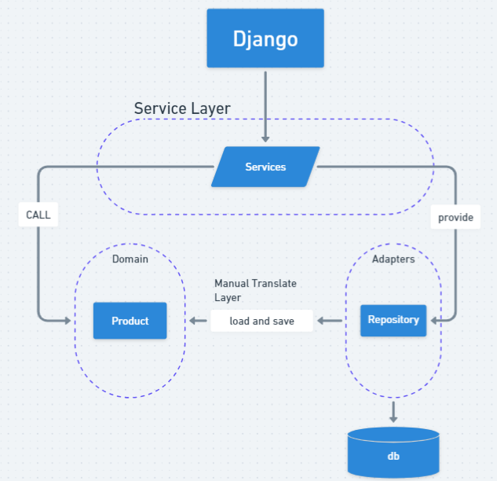

# django-rp

此主要用於紀錄使用 Django 框架並透過 Repository Pattern 模式設計 endpoint

## Component diagram



## 指令

- 建立虛擬環境


```bash
    python -m venv .venv
```

- 進入虛擬環境

```bash
    source ./.venv/bin/activate # MacOS

    .\.venv\Scripts\activate # Windows
```

- 安裝第三方依賴

```bash
    pip install -r requirements.txt
```

- 複製環境變數檔案，並修改裡面的值

```bash
    cp .env.sample .env
```

- 更新資料庫 schema 以及啟動伺服器

```bash
    python ./django/manage.py migrate
    python ./django/manage.py runserver
```

## Reference

- [架構模式用 Python](https://www.cosmicpython.com/book/preface.html)
