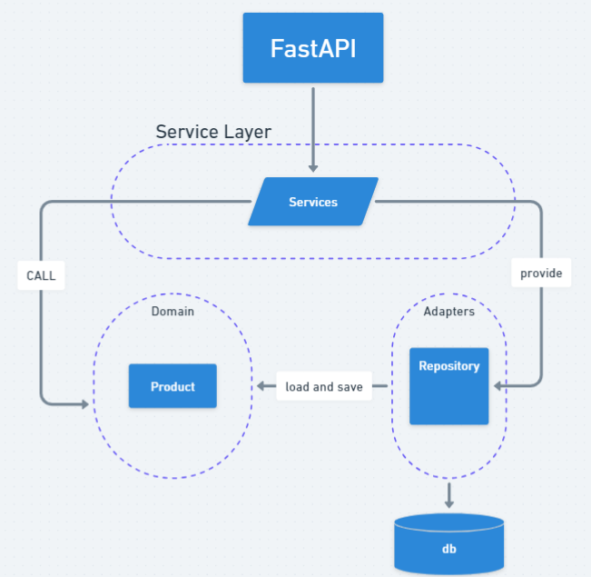

# Repository Pattern

此儲存庫主要紀錄使用 DDD 的 Python 框架程式碼，並以不同的分支名稱進行分類

## Component diagram



## 指令

- 建立虛擬環境


```bash
    python -m venv .venv
```

- 進入虛擬環境

```bash
    source ./.venv/bin/activate # MacOS

    .\.venv\Scripts\activate # Windows
```

- 安裝第三方依賴

```bash
    pip install -r requirements.txt
```

- 遷移資料庫
  
```bash
    alembic upgrade head
```

- 啟動伺服器

```bash
    uvicorn app.main:app --reload
```

## Reference

- [架構模式用 Python](https://www.cosmicpython.com/book/preface.html)
